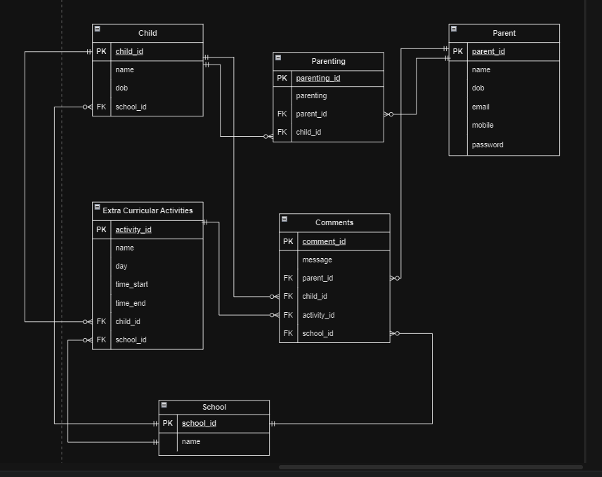

For people under coercive control that decide to leave their partners, the main one rule is zero contact, unfortunately, when there are children involved, zero contact it's out of the cards, in order to be able to communicate about the children schedule it's absolutely necessary for the other partner to have access to their mobile number or email address as a way of communication. 

Messaging through mobile messaging apps and even more social media apps like Messenger, Instagram,  WhatsApp, etc. you need to share your mobile number, email address or nickname, to be able to engage in communication. In some of this apps you can delete messages, and even in some like Messenger you can even unsend messages which even get deleted on the recipient end, which can lead the coercive ex partner to send intimidating and threatening messages and delete them as they please to change to context of the conversation and to their advantage.

Therefore this Webserver Project is to create an application that serves as a means of communication between the parents in regards to children activities, with the advantage that there is no need to engage in communication by any other means. Another advantage of this app is that under no circumstances messages can be deleted, decreasing the opportunity of misuse like  intimidating or threating messages.

I decided to use PostgreSQL because is the one we have been using in class and has many advantages:

* It's an open source database therefore it can be used in most operating systems like Microsoft, Linux, and Mac.

* PostgreSQL operation is catalogue-driven, meaning it stores its information not only about the tables and databases but also methods to access the data, the data types, and the functions within. All this can be easily modified by the user.

* It can be used with many programming languages like SQL, Python, Java, R, Shell, among others.

* PostgreSQL extends the SQL language with many features to create functions, data types, maintain data integrity and performance, provide advanced authentication for security, data encryption, etc.

* As it is fully compliant with ACID(Atomicity, Consistency, Isolation, Durability) so it can be used for Online Transaction Processing for the financial industry.

* It can handle large amounts of data.

* Supports geographic objects for location-based services.

* It's free, reliable and flexible, which makes it the one of the most used DBMS.

It's drawbacks are that as it's open source, there's no warranty or liability protection,  it can become slow if there is a large amount of data when generating a query as it has to go through the whole table to find the data.

#### ORM

With Object Relational Mapping we can transfer the data in our relational database tables into objects automatically, which creates a bridge between these and it's relationships, this allow us to work with our data as objects in python (or any other chosen programming language), but in my case python, and this data is then stored in the relational database management system using SQL.

With ORM's API's we can define classes or objects to manipulate the data in our tables, meaning we can write our code using Python instead of SQL, which makes the development of the project faster.

In this particular project I am using SQLAlchemy as ORM, PostgreSQL for relational database which uses psycopg as database connector.

Once the mapping has been defined an ORM instance is created to perform CRUD operations using objects in python, and with these we can access data from the database using SQL queries to modify, delete, and manage the data.

Another benefit of ORM's is that it allows us to define permissions and authorizations to protect sensitive information.

#### API endpoints

The endpoints for this project are:

http://localhost:8080 plus the following:

 

The ERD diagram for the Parenting app is this:

 

In this ERD the parent is the main user that will login into the app.

There is a parenting table that specifies the parenting the parent has towards the children, which could be Mother, Father, Grandmother, etc

There is the school table that is linked to the children and to the extracurricular activities the children attend to, which specifies the activities schedule and the school the activity takes place.

And there is the comments table in which parents can send messages to the other parent, about a specific child, activity or school. Its important to note that these messages CANNOT be deleted, so in the case of intimidation or threats these can be used for proof to authorities.

#### Third party services

Here I am using:

* psycop2-binary as the database adapter for Python
* flask_sqlalchemy which gives an ORM that will allow us to handle the data and make queries.
* flask_marshmallow to validate and transform JSON data 
* marshmallow-sqlalchemy to convert our dictionaries to the SQLAlchemy models, it maps our tables and data into objects.
* flask_bcrypt for password protection, it appends a salt to the password by hashing.
* flask_jwt_extended to create JSON web tokens, protect routes and identification.
* os to interact with the operating system, to create and remove directories and managing them.
* datetime for the use of date and time attributes.
* Blueprint to to improve the app architecture.

#### Models

The Child Model has a relationship with the school, parentings, activities, and comments Model:

* *school = db.relationship('School', back_populates='children', cascade='all, delete')* : Many children can attend one particular school, if all children stop attending this school, it will delete.
* *parentings = db.relationship('Parenting', back_populates='child')* : Each child has a relationship in the parentings table with a parent.
* *activities = db.relationship('Activity', back_populates='child', cascade='all, delete')* : Each child can have many activities, the activity will be deleted if no child does that activity anymore.
* *comments = db.relationship('Comment', back_populates='child')* : Many comments can be made about a particular child.

The Parent Model has a relationship with the parentings and comments Model:

* *parentings = db.relationship('Parenting', back_populates='parent')* : Parent is related with a child through the parentings table, being Mother, Father, etc.
* *comments = db.relationship('Comment', back_populates='parent')* : A parent in the parenting table can create different comments.

The Parenting Model has relationship with the parent and child Model:

* *parent = db.relationship('Parent', back_populates='parentings')* : In the parentings table will be parent and child who are related each parent to a child.
* *child = db.relationship('Child', back_populates='parentings')* : In the parentings table will be parent and child who are related each parent to a child.

The School Model has relationship with the children, activities, and comments Model:

*  *children = db.relationship('Child', back_populates='school', cascade='all, delete')* : Each school has a child enrolled in it, many children can be enrolled in it, if no children is no longer enrolled, it will be deleted.
* *activities = db.relationship('Activity', back_populates='school', cascade='all, delete')* : Each school has one or many activities, if an activity is no longer used, it will be deleted.
* *comments = db.relationship('Comment', back_populates='school')* : Many comments can be made about the activities.

The Activity Model has relationship with the child, school, and comments Model:

* *child = db.relationship('Child', back_populates='activities')* : A child can have many activities.
* *school = db.relationship('School', back_populates='activities', cascade='all, delete')* : A school can have many activities, if the activity is no longer used, it will be deleted.
* *comments = db.relationship('Comment', back_populates='activities')* : Many comments can be made for the activities.

The Comment Model has relationship with the parent, child, activities, and school:

* *parent = db.relationship('Parent', back_populates='comments')*
* *child = db.relationship('Child', back_populates='comments')*
* *activities = db.relationships('Activity', back_populates='comments')*
* *school = db.relationship('School', back_populates='comments')*

Many comments can be made to all this other tables.

#### Database Relations

As seen on the ERD the relations are as follow:

In the parentings table we have:

* **parenting_id** as primary key
* **parenting** which will be Mother, Father, etc.
* **parent_id** as foreign key *(Many parents can be in the parenting table)
* **child_id** as foreign key *(Many children can be in the parenting table)*

In the Parent table we have:

* **parent_id** as primary key *(Each parent has a relation with the parentings table, and each parent can make multiple comments)*

In the Child table we have:

* **child_id** as primary key
* **school_id** as foreign key *(One child can attend many schools)*

In the activities table we have:

* **activity_id** as primary key
* **child_id** as foreign key *(One child can have many activities)*
* **school_id** as foreign key *(One school can provide many activities)*

In the school table we have:

* **school_id** as primary key *(One school can have many activities, many children, and many comments can be made about that school)*

In the comments table we have:

* **comment_id** as primary key
* **parent_id** as foreign key *(one parent can make many comments about another parent)*
* **child_id** as foreign key *(many comments can be made about one child)*
* **activity_id** as foreign key *(many comments can be made about one activity)*
* **school_id** as foreign key *(many comments can be made about one school)*